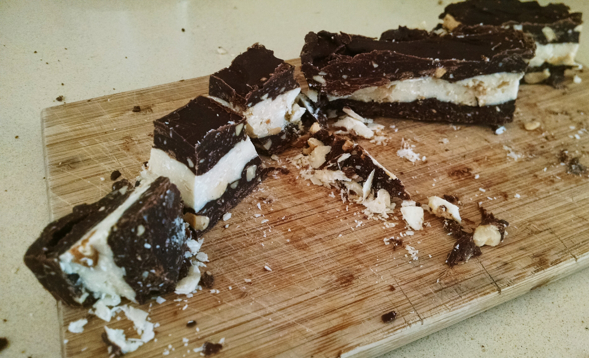

# Chunky Chocolate Bites

This peanut-laden chocolate bites are generically known by the most famous brand that makes them in Argentina (Marroc).

## Ingredients
- Peanuts (roasted, unsalted) (roughly the same amount by volume as chocolate)
- White chocolate
- Semi-sweet chocolate (roughly double the amount as white chocolate)
- Sesame oil (or some other vegetable oil)

## Directions

- Crush the peanuts into a paste by putting them in a blender with a bit of oil (you can alternatively use unsalted peanut butter)
- Melt half the semi-sweet chocolate and mix it with 1/3 of the peanut butter
- Spread the paste into a pan (about 1/3 inch thick) and put in the freezer while you prepare the next layer
- Repeat the last two steps with white and then semi-sweet chocolate
- Cut into cubes
- Serve at room temperature

## Serving ideas

- Just eat them!
- Cut them in smaller chunks and use them as a topping for ice cream
