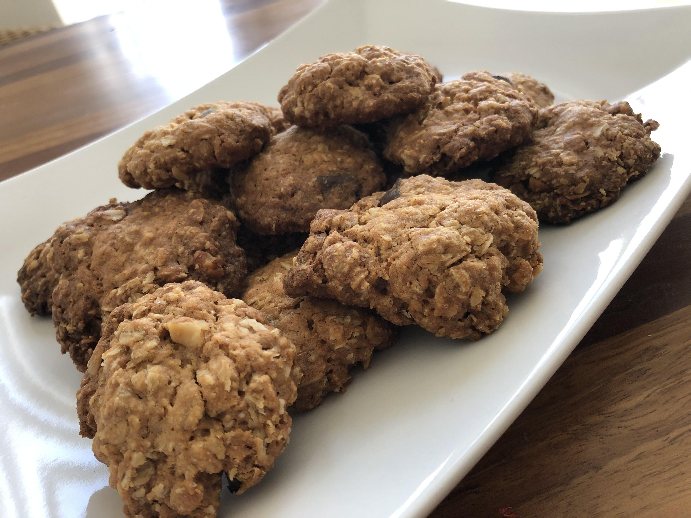

# Oatmeal Cookies

Great and simple oatmeal cookies that can be tweaked with things like chocolate chips, walnuts, almonds, colorful sprinkles or whatever you'd like.

## Ingredients
- 125g of general purpose, unbleached wheat flour
- 1/2 teaspoon of cinnamon
- 1/2 teaspoon of baking powder
- 1/4 teaspoon of salt
- 115g of unsalted butter
- 100g of brown sugar
- 1 egg
- A dash of vanilla extract
- 150g of rolled oats

## Directions

- Mix the flour, cinnamon, and baking powder and set apart
- Mix the butter and the sugar until they are homogeneous
- Add the egg and the vanilla extract to the butter and sugar
- Slowly add the flour mix
- Add the oats, and whatever customization you want (chocolate chips, walnuts, etc.)
- Put the mix in the fridge for about 30'
- Preheat the oven to 350°F
- Shape the cookies and cook them for 10' to 12'
