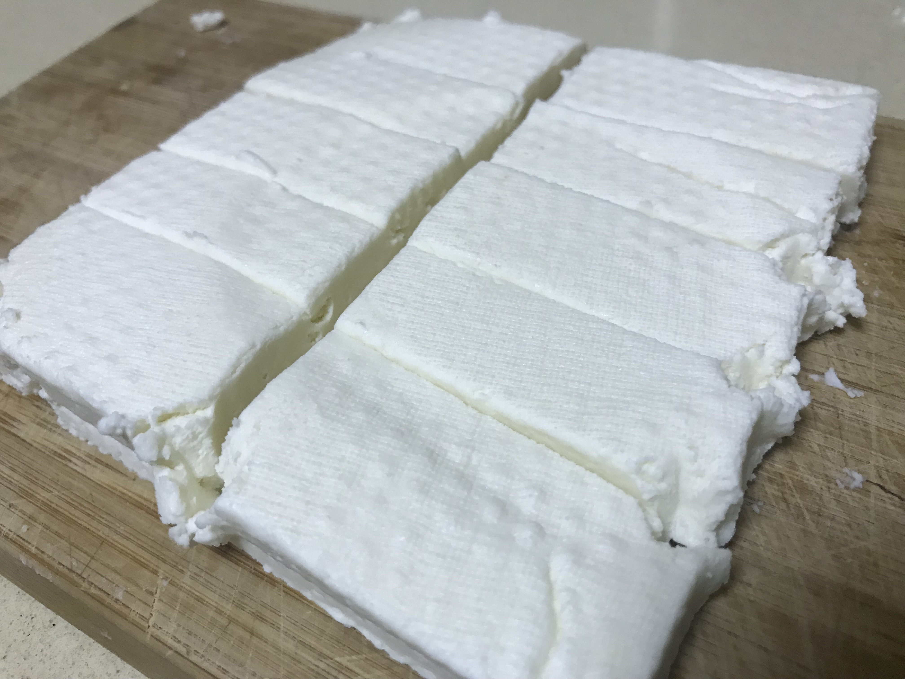
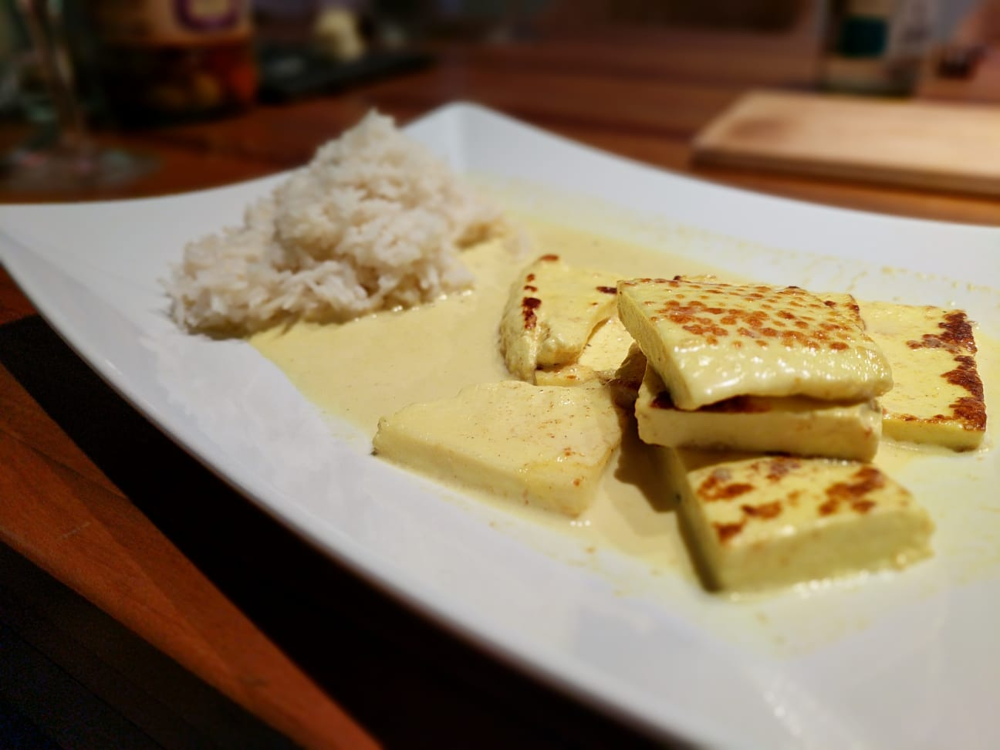

# Paneer

Paneer is a fresh cheese common in South Asia, especially in India.

## Ingredients
- 1 gallon of whole milk (NOT ultra-pasteurized)
- 1/2 cup of lemon juice
- 1/2 cup of white vinegar
- 2.5 oz of yogurt (my current favorite is skyr, the Icelandic cultured dairy product)
- Salt
- Cheesecloth

## Directions

- Pour the milk in a big pot, add salt to taste
- Bring the milk to 85°C
- Add the yogurt and stir
- Take the pot out of the heat and add the juice
- Stir slightly to allow curds to form, let it sit for 15 to 30 minutes
- Put the curds over a cheescloth and into a strainer, add weight on top and let sit overnight

## Serving ideas

- Add to a curry

- Seal in a hot pan with a bit of oil and then paint with either bbq sauce or pesto
