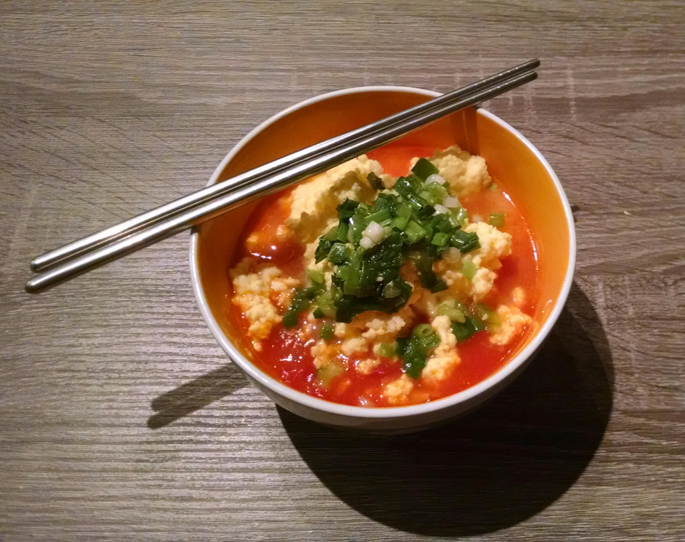

# 西红柿鸡蛋汤 (Tomato and Egg Soup)
(xī hóng shì jī dàn tāng)

Fairly common Chinese dish that's both easy to prepare and delicious. It can be made more or less soup-y, according to taste

## Ingredients
- 1-2 tomatoes
- 2 eggs
- green onion leaves
- salt

### Optionals

- Sesame oil
- Soy sauce

## Directions

- Slice the tomatoes, chop the green onions and beat the eggs
- Pour the eggs into boiling water (as much/little as soup-y or not you want your dish) until they are cooked
- Add the tomato slices, season, and cook for 1 more minute
- Serve, add the green onions and sprinkle as desired with oil/soy sauce
